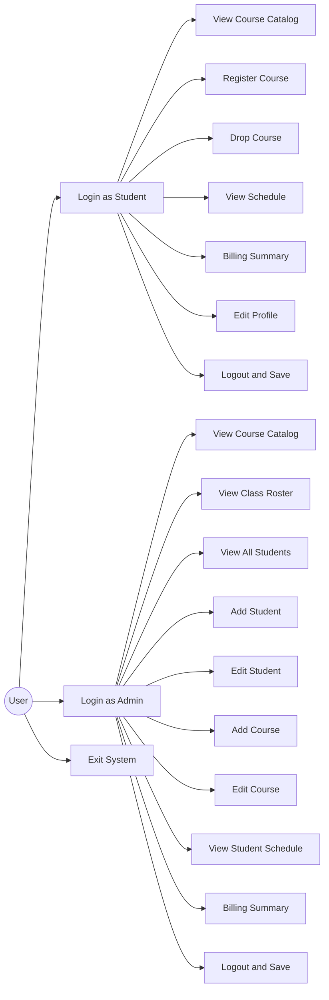
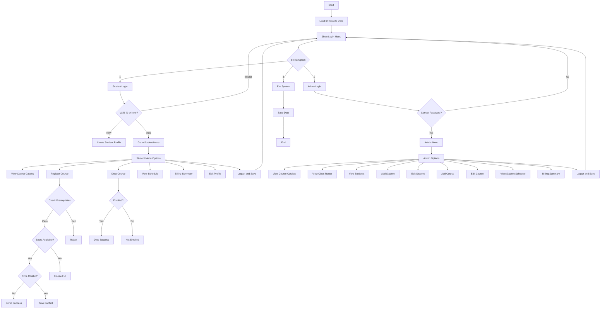

# unknownapp
This is an unknown application written in Java

---- For Submission (you must fill in the information below) ----
### Use Case Diagram
## Use Case Diagram

---

## Flowchart

---
config:
      theme: redux
---
flowchart TD
    A[Start] --> B[Load or Initialize Data]

    B --> C[Show Login Menu]
    C --> D{Select Option}

    D -->|1| E[Student Login]
    D -->|2| F[Admin Login]
    D -->|3| G[Exit System]

    %% Student Login Logic
    E --> H{Valid ID or New?}
    H -->|New| I[Create Student Profile]
    I --> J[Go to Student Menu]
    H -->|Valid| J
    H -->|Invalid| C

    %% Student Menu Loop
    J --> K[Student Menu Options]
    K --> K1[View Course Catalog]
    K --> K2[Register Course]
    K --> K3[Drop Course]
    K --> K4[View Schedule]
    K --> K5[Billing Summary]
    K --> K6[Edit Profile]
    K --> K7[Logout and Save]

    K7 --> C

    %% Course Registration Logic
    K2 --> R1{Check Prerequisites}
    R1 -->|Pass| R2{Seats Available?}
    R1 -->|Fail| RFail1[Reject]
    RFail1 --> K

    R2 -->|Yes| R3{Time Conflict?}
    R2 -->|No| RFail2[Course Full]
    RFail2 --> K

    R3 -->|No| RSuccess[Enroll Success]
    R3 -->|Yes| RFail3[Time Conflict]
    RSuccess --> K
    RFail3 --> K

    %% Course Drop Logic
    K3 --> D1{Enrolled?}
    D1 -->|Yes| DSuccess[Drop Success]
    D1 -->|No| DFail[Not Enrolled]
    DSuccess --> K
    DFail --> K

    %% Return other actions to menu
    K1 --> K
    K4 --> K
    K5 --> K
    K6 --> K

    %% Admin Login Logic
    F --> L{Correct Password?}
    L -->|No| C
    L -->|Yes| M[Admin Menu]

    %% Admin Menu Loop
    M --> N[Admin Options]
    N --> N1[View Course Catalog]
    N --> N2[View Class Roster]
    N --> N3[View Students]
    N --> N4[Add Student]
    N --> N5[Edit Student]
    N --> N6[Add Course]
    N --> N7[Edit Course]
    N --> N8[View Student Schedule]
    N --> N9[Billing Summary]
    N --> N10[Logout and Save]

    N10 --> C
    
    %% Admin Sub-actions returning to menu
    N1 & N2 & N3 & N4 & N5 & N6 & N7 & N8 & N9 --> N

    %% Exit Logic
    G --> S[Save Data]
    S --> T[End]

### Prompts
- Analyze the given Java course enrollment system and identify all main functionalities.
- Generate a use case diagram in Mermaid syntax for a system with Student and Admin roles.
- Create a flowchart (Mermaid) representing the main program flow including login, student menu, and admin menu.
- Add validation logic such as prerequisite checking, course capacity, and time conflict into the flowchart.
- Convert selected Java functionality (e.g., course registration) into an equivalent Python implementation.
- Improve Mermaid diagram readability and fix syntax errors for GitHub rendering.
